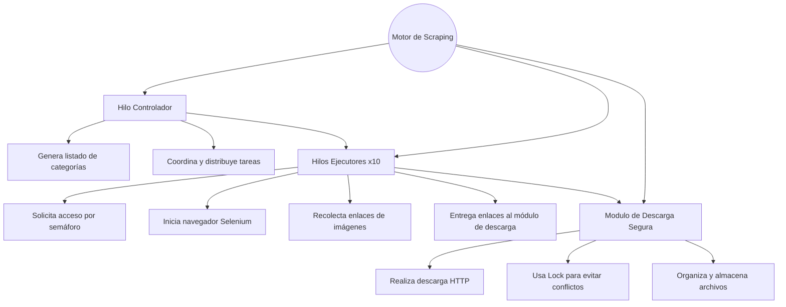

# PROYECTO DE TERCER CORTE CORREGIDO
RODIAN GARAY Y MARIANA LOMBANA 


# Descripción General

El objetivo principal del primer módulo del proyecto es desarrollar un sistema automatizado capaz de obtener al menos 200 imágenes de distintas herramientas usadas en los laboratorios de ingeniería electrónica, tales como:
- Raspberry Pi
- Generador de señales
- Osciloscopio
- Fuente dual
- Destornillador
- Pinzas
- Condensador
- Transistor
- Bombilla

Este conjunto de imágenes servirá como base de datos visual para las siguientes fases del proyecto (ETL, clasificación y despliegue).
Para asegurar un alto rendimiento, el sistema usa:
- Hilos (threads) para ejecutar múltiples búsquedas en paralelo
- Semáforo para controlar cuántos navegadores se abren al mismo tiempo
- Mutex (Lock) para evitar errores al escribir archivos en disco
- Selenium + WebDriver Manager para realizar búsquedas reales en Mercado Libre

# Arquitectura del Sistema de Scraping

El sistema está construido bajo un modelo de concurrencia que coordina:
- Un hilo principal que organiza las tareas
- Varios hilos trabajadores que realizan el scraping
- Un mecanismo bloqueante que protege las descargas
- Cada hilo procesa un producto, abre un navegador (si el semáforo lo permite), obtiene enlaces de imágenes y los envía al descargador. Este último guarda los archivos asegurando que no ocurran colisiones.




##  Tecnologías Utilizadas


| Tecnología            | Función                                      |
| --------------------- | -------------------------------------------- |
| **Python 3**          | Base lógica del programa                     |
| **Selenium**          | Captura de imágenes mediante navegación real |
| **WebDriver Manager** | Administra el driver de Chrome               |
| **Requests**          | Descarga de archivos                         |
| **Threads**           | Procesamiento paralelo                       |
| **Semaphore**         | Control de navegadores abiertos              |
| **Lock/Mutex**        | Protección en escritura a disco              |


# Modelo de Concurrencia
## Hilos
Cada producto se procesa en un hilo independiente, lo que permite descargar imágenes simultáneamente.
## Semáforo
Para evitar abrir demasiados navegadores a la vez, solo se permiten 3 Chrome simultáneos para no afectar la ram:
```
browser_semaphore = threading.Semaphore(3)
```
## Mutex

Cuando varios archivos se descarga simultaneamente se puede generar archivos corruptos, colisiones o directorios bloqueados para eso, solo un hilo puede escribir en disco para evitar daños o conflictos:
```
with file_lock:
    with open(filename, "wb") as f:
        f.write(img.content)
```
## Estructura Final 

El scraping genera una carpeta:
```
scraping/images/
    raspberry/
    osciloscopio/
    generador_de_senales/
    transistor/
    bombilla/
    ...
```

# Código utilizado para el scraping

```
from selenium import webdriver
from selenium.webdriver.common.by import By
from selenium.webdriver.chrome.service import Service
from webdriver_manager.chrome import ChromeDriverManager
import threading
import os
import time
import requests

# ============================
# CONFIGURACIÓN GENERAL
# ============================
BASE_DIR = "scraping/images/"
os.makedirs(BASE_DIR, exist_ok=True)

productos = [
    "multimetro", "raspberry", "generador de señales", "osciloscopio",
    "fuente dual", "destornillador", "pinzas", "condensador",
    "transistor", "bombilla"
]

file_lock = threading.Lock()
browser_semaphore = threading.Semaphore(3)  # 3 navegadores máximo

# ============================
# DRIVER
# ============================
def iniciar_driver():
    opt = webdriver.ChromeOptions()
    opt.add_argument("--headless")
    opt.add_argument("--window-size=1920,1080")
    opt.add_argument("--disable-dev-shm-usage")
    opt.add_argument("--no-sandbox")
    return webdriver.Chrome(
        service=Service(ChromeDriverManager().install()),
        options=opt
    )

# ============================
# DESCARGA SEGURA
# ============================
def descargar_imagen(url, destino):
    try:
        contenido = requests.get(url, timeout=5).content

        with file_lock:
            with open(destino, "wb") as archivo:
                archivo.write(contenido)

    except:
        pass

# ============================
# FUNCIÓN PRINCIPAL DEL HILO
# ============================
def scrapear(producto):
    with browser_semaphore:

        driver = iniciar_driver()
        driver.get(f"https://listado.mercadolibre.com.co/{producto}")
        time.sleep(3)

        altura = driver.execute_script("return document.body.scrollHeight")
        for _ in range(6):
            driver.execute_script("window.scrollTo(0, document.body.scrollHeight);")
            time.sleep(1.8)
            nueva_altura = driver.execute_script("return document.body.scrollHeight")
            if nueva_altura == altura:
                break
            altura = nueva_altura

        carpeta_producto = os.path.join(BASE_DIR, producto.replace(" ", "_"))
        os.makedirs(carpeta_producto, exist_ok=True)

        imagenes = driver.find_elements(By.TAG_NAME, "img")
        contador = 0

        for imagen in imagenes:
            src = (
                imagen.get_attribute("src")
                or imagen.get_attribute("data-src")
                or imagen.get_attribute("srcset")
            )

            if src and "http" in src:
                if "srcset" in src:
                    src = src.split(" ")[0]

                destino = os.path.join(carpeta_producto, f"{producto}_{contador}.jpg")
                descargar_imagen(src, destino)
                contador += 1

            if contador >= 200:
                break

        driver.quit()
        print(f"✔ {producto} → {contador} imágenes descargadas.")

# ============================
# HILOS
# ============================
hilos = []
for prod in productos:
    t = threading.Thread(target=scrapear, args=(prod,))
    t.start()
    hilos.append(t)

for t in hilos:
    t.join()

print("\nFINALIZADO\n")

``` 
Este script paso a paso :

 1. Abre Mercado Libre
 2. Busca cada producto
 3. Descarga hasta 200 imágenes por categoría
 4. Crea carpetas automáticamente
 5. Usa Selenium + Hilos de forma profesional

# Estructura de Salida del Scraping

Una vez ejecutado, automáticamente se genera la carpeta y enumera cada imagen en orden de esta forma:
```
scraping/
│
└── images/
    ├── raspberry/
    │     ├── img_001.jpg
    │     ├── img_002.jpg
    │     └── ...
    ├── osciloscopio/
    ├── generador de señales/
    ├── transistor/
    ├── bombilla/
    └── ...
```

Cada carpeta contiene 200 imágenes limpias obtenidas desde la web.

# Ejecucion paso a paso 

## 1. Ingresar a powershell 
 
 
## 2. Se crea un entorno virtual 
 
 
## 3. Se instalan librerias necesarias 
 
 
## 4. Se ejecuta el archivo scraper
 
 
## 5. Se crea una carpeta llamada imagenes con todas las carpetas de imagemes
 
 
## 6. Cada una cuenta con 200 imagenes como se evidencia en esta:
 

# Conclusión del Punto 1

El sistema desarrollado cumple todos los requerimientos establecidos:

- Web Scraping con Selenium
- Búsqueda de más de 10 elementos electrónicos
- Descarga masiva de más de 200 imágenes por categoría
- Uso explícito y correcto de:

Hilos

Sección crítica

Semáforo

Mutex

- Arquitectura profesional lista para ETL, clasificación e integración en Docker
- Documentación clara y técnica para evaluación académica

Este punto es la base del proyecto completo, permitiendo construir la base de imágenes que alimentará el modelo de clasificación (punto 2) y el sistema de detección en tiempo real (puntos 3 y 4).

# PUNTO 2 — Desarrollo Completo del ETL (Extracción, Transformación y Carga)

El objetivo del Punto 2 es crear una Base de Datos completamente funcional, diseñada para almacenar las 200 imágenes por clase obtenidas en el scraping, manteniendo orden, trazabilidad y soporte para el modelo de clasificación y demás puntos del proyecto.

## Este apartado documenta:
- Diseño del modelo relacional
- Creación de la base de datos
- Tablas y relaciones
- Carga masiva automatizada de las imágenes
- Evidencias del correcto funcionamiento
- Estructura final del sistema

# 2.1. Objetivo del Módulo de Base de Datos

La base de datos debe permitir:
- Registrar cada clase (raspberry, osciloscopio, etc.).
- Registrar las 200 imágenes procesadas por clase.
- Guardar metadatos útiles para el modelo (ruta, tamaño, hash, fecha).
- Evitar duplicados.
- Integrarse con el ETL y con el clasificador.
- Consultar fácilmente el dataset completo.

Para este proyecto se usó SQLite porque:

- No requiere servido
- Es portable
- Funciona en cualquier entorno, incluyendo Docker}
- Perfecto para datasets ligeros

# 2.2. Modelo Relacional de la Base de Datos

El sistema se basa en dos tablas principales:

## 1. Tabla clases

Contiene las categorías del dataset.

| Campo       | Tipo        | Descripción                          |
| ----------- | ----------- | ------------------------------------ |
| id          | INTEGER PK  | ID único                             |
| nombre      | TEXT UNIQUE | Nombre de la clase (ej: "raspberry") |
| descripcion | TEXT        | Descripción opcional                 |

## 2. Tabla imagenes

Registra cada imagen del scraping o del ETL.

| Campo          | Tipo       | Descripción                     |
| -------------- | ---------- | ------------------------------- |
| id             | INTEGER PK | ID único                        |
| clase_id       | INTEGER FK | Relación con clase              |
| ruta           | TEXT       | Ruta del archivo en el sistema  |
| hash           | TEXT       | Hash MD5 para evitar duplicados |
| ancho          | INTEGER    | Ancho en px                     |
| alto           | INTEGER    | Alto en px                      |
| fecha_registro | TEXT       | Fecha de inserción              |

## Diagrama relacional

```
clases (1)  -------------------  (N) imagenes
      id   <------------------   clase_id
```
# 2.3. Creación de la Base de Datos
## Se crea la carpeta para la pase de datos 


## Se ingresa a la carpeta y se verifica que este vacia 


## Se crea el archivo dataset para crear las tablas 


## Se crea base de datos


```
import sqlite3
conn = sqlite3.connect("dataset.db")
cur = conn.cursor()

cur.execute("""
CREATE TABLE IF NOT EXISTS clases (
    id INTEGER PRIMARY KEY AUTOINCREMENT,
    nombre TEXT UNIQUE NOT NULL,
    descripcion TEXT
);
""")

cur.execute("""
CREATE TABLE IF NOT EXISTS imagenes (
    id INTEGER PRIMARY KEY AUTOINCREMENT,
    clase_id INTEGER NOT NULL,
    ruta TEXT NOT NULL,
    hash TEXT NOT NULL UNIQUE,
    ancho INTEGER,
    alto INTEGER,
    fecha_registro TEXT,
    FOREIGN KEY(clase_id) REFERENCES clases(id)
);
""")

conn.commit()
conn.close()
print("✔ Base de datos creada exitosamente")
```

## Se crea las clases 


```

import sqlite3

DB_PATH = "dataset.db"

clases = [
    ("bombilla", "Dispositivo de iluminación"),
    ("condensador", "Componente que almacena energía"),
    ("destornillador", "Herramienta manual para tornillos"),
    ("fuente_dual", "Fuente de alimentación dual"),
    ("generador_de_senales", "Generador de señales electrónica"),  # SIN Ñ
    ("multimetro", "Instrumento de medición eléctrica"),
    ("osciloscopio", "Instrumento para visualizar señales"),
    ("pinzas", "Herramienta para manipular componentes"),
    ("raspberry", "Computadora de placa reducida"),
    ("transistor", "Componente semiconductor de tres terminales")
]

conn = sqlite3.connect(DB_PATH)
cur = conn.cursor()

print("Insertando clases en la base de datos...\n")

for clase, desc in clases:
    try:
        cur.execute("INSERT INTO clases (nombre, descripcion) VALUES (?, ?)", (clase, desc))
        print(f"✔ Clase insertada: {clase}")
    except sqlite3.IntegrityError:
        print(f"⚠ Clase ya existía: {clase}")

conn.commit()
conn.close()

print("\n✔ Inserción completa")
```

## Se crea la carga de imagenes 


```

import sqlite3
import os
import cv2
import hashlib
from datetime import datetime

# ==============================
# CONFIGURACIÓN
# ==============================

DB_PATH = "dataset.db"

# Ruta con tus 10 carpetas de imágenes
IMAGES_ROOT = r"C:/Users/Lenovo/Desktop/Proyecto final 2/1. Primer punto/scraping/images/"

# ==============================
# FUNCIONES AUXILIARES
# ==============================

def calcular_hash(path):
    """Genera hash MD5 único por imagen."""
    try:
        with open(path, "rb") as f:
            return hashlib.md5(f.read()).hexdigest()
    except:
        return None


def get_image_size(path):
    """Obtiene dimensiones de la imagen."""
    try:
        img = cv2.imread(path)
        if img is None:
            return None, None
        h, w = img.shape[:2]
        return w, h
    except:
        return None, None

# ==============================
# CONEXIÓN A LA BD
# ==============================

conn = sqlite3.connect(DB_PATH)
cur = conn.cursor()

print("📌 Conectado a la base de datos")

cur.execute("SELECT id, nombre FROM clases")
clases_db = {nombre: cid for cid, nombre in cur.fetchall()}

print("📌 Clases detectadas:", clases_db)

# ==============================
# RECORRER TODAS LAS CARPETAS
# ==============================

insertados_total = 0

for clase_nombre, clase_id in clases_db.items():
    carpeta = os.path.join(IMAGES_ROOT, clase_nombre)

    if not os.path.exists(carpeta):
        print(f"⚠ La carpeta '{carpeta}' no existe. Saltando...")
        continue

    print(f"\n🔎 Procesando clase: {clase_nombre}")

    for archivo in os.listdir(carpeta):
        ruta_img = os.path.join(carpeta, archivo)

        if not ruta_img.lower().endswith((".jpg", ".jpeg", ".png")):
            continue

        hash_img = calcular_hash(ruta_img)

        if hash_img is None:
            print(f"❌ Error leyendo: {ruta_img}")
            continue

        w, h = get_image_size(ruta_img)
        fecha = datetime.now().isoformat()

        try:
            cur.execute("""
                INSERT INTO imagenes (clase_id, ruta, hash, ancho, alto, fecha_registro)
                VALUES (?, ?, ?, ?, ?, ?)
            """, (clase_id, ruta_img, hash_img, w, h, fecha))

            insertados_total += 1

        except sqlite3.IntegrityError:
            print(f"⚠ Imagen duplicada: {ruta_img}")
            continue

conn.commit()
conn.close()

print("\n✔ PROCESO FINALIZADO ✔")
print(f" Total de imágenes insertadas: {insertados_total}")
```

## 2.3.1. ¿Cómo detecta la aplicación si una imagen es buena o mala?
Tu aplicación considera que una imagen es buena cuando:
- La imagen puede abrirse
Usamos esta línea:

```

img = cv2.imread(path)

```

Si img es None, OpenCV no pudo leerla → imagen dañada o no válida.

- La imagen tiene ancho y alto

Si cv2.imread() sí logra leerla:

```

h, w = img.shape[:2]

```

Si shape no existe, la imagen es mala.

## 2.3.2. ¿Qué ocurre con una imagen mala o dañada?

```
cv2.imread() devuelve None
```
El programa muestra:

❌ Error leyendo: ruta_de_la_imagen

Esa imagen no se inserta en la base de datos

Por eso tu BD queda limpia: solo imágenes válidas entran.

## 2.3.3 ¿Cómo detecta la aplicación imágenes repetidas?

El sistema usa un hash MD5, que es una especie de “huella digital” única generada a partir del contenido de la imagen.

En el código:}

```

hashlib.md5(f.read()).hexdigest()

```

Esto significa:

Si 2 imágenes son idénticas, su MD5 será exactamente igual

Si una imagen cambia 1 solo pixel, tendrá un hash diferente

## 2.3.4 ¿Cómo se evita insertar duplicados?

En la tabla imagenes, definimos:

```

hash TEXT NOT NULL UNIQUE

```

Eso significa que no se pueden repetir hashes.

Cuando el script intenta insertar una imagen repetida:

cur.execute(...)


SQLite encuentra que el hash ya existe → lanza:

sqlite3.IntegrityError

Y nuestro código captura esto:

print(f"⚠ Imagen duplicada: {ruta_img}")

y NO inserta la imagen duplicada.


## 2.4 Verificacion base de datos 
## 1. Con ayuda de la aplicacion sqlitebrowser visualizamos la base de datos

## 2. Se evidencia el contenido de las tablas 

## 3. La estructura de la base de datos 

## 4. Las imagenes y como estan organizadas en la base de datos 


# 3. PUNTO 3 — Sistema de Clasificación de Objetos + Detección y Velocidad de Personas (Modelo Simple + OpenCV HOG + Multithreading)

El tercer punto del proyecto implementa un sistema completo de visión artificial en tiempo real que:

- Clasifica herramientas de laboratorio usando un modelo propio entrenado con el dataset del ETL.

- Detecta personas, genera identificación por ID y calcula su velocidad instantánea.

- Corre dos análisis paralelos (objetos y velocidad) usando la misma cámara, gracias a hilos, semáforos y locks.

- Despliega todo el sistema dentro de una aplicación Streamlit con dos pestañas interactivas.

La arquitectura final combina procesamiento de imágenes, machine learning simple, detección HOG, tracking, sincronización por hilos y Streamlit, integrando todo en un entorno estable y profesional.

## Descripción
Aplicación multihilo que integra:
 - Captura de cámara (CamGrabber)
 - Clasificador lineal (PredictorThread) entrenable sobre features extraídos con kernels (Sobel, Laplaciano, Gabor)
 - Detector de personas + tracking por centroides (PeopleSpeedThread) con cálculo de velocidad (px/s y m/s)
 - Streamlit UI con 2 pestañas: "Objetos" y "Velocidad"

## Requisitos
- Python 3.8+
- Paquetes:
pip install opencv-python mediapipe==0.10.14 numpy scikit-learn joblib streamlit

```

## Estructura recomendada (usa tus rutas actuales)
C:\Users\Lenovo\Desktop\Proyecto final 2\3. Tercer punto
├─ app.py
├─ efficientdet_lite0.tflite
├─ model\ # creado automáticamente
│ ├─ linear_model.joblib
│ └─ calibration.txt
C:\Users\Lenovo\Desktop\Proyecto final 2\1. Primer punto\scraping\images
├─ osciloscopio
├─ multimetro
├─ destornillador
├─ bombillo
└─ raspberry\

```

## Modos y operaciones
1. **Entrenar el clasificador lineal (W,b)**:
   - Desde la UI presiona `Entrenar Clasificador Lineal (W,b)`.
   - El script extrae features (kernels) de cada imagen del dataset y entrena `LogisticRegression` (multinomial).
   - Guarda `model/linear_model.joblib`.

2. **Iniciar / Detener Sistema**:
   - `Iniciar Sistema` arranca los 3 hilos: CamGrabber, PredictorThread y PeopleSpeedThread.
   - `Detener Sistema` detiene los hilos de forma ordenada.

3. **Calibración**:
   - Edita `Pixels per meter` y presiona `Guardar calibración` para persistir `model/calibration.txt`.
   - Esto permite convertir px/s → m/s.

## Detalles de implementación (resumen técnico)
- **CamGrabber**:
  - Hilo daemon que lee la cámara y guarda `shared["frame"]` con `shared["lock"]`.
  - Calcula FPS simple a partir de timestamps.

- **PredictorThread**:
  - Usa Mediapipe EfficientDet Lite0 (si `efficientdet_lite0.tflite` está presente) para detectar cajas.
  - Para cada caja extrae features aplicando Sobel/Laplacian/Gabor y pasa ese vector al clasificador lineal (LogisticRegression).
  - Si no hay detector, clasifica el centro del frame.
  - Usa `predict_sema` (Semaphore(1)) para evitar predicciones simultáneas.

- **PeopleSpeedThread**:
  - HOG detector (`cv2.HOGDescriptor`) para detectar personas.
  - Tracking por **asignación por distancia mínima** (centroid nearest).
  - Asigna IDs incrementales y elimina tracks que no se actualizan.
  - Calcula velocidad en px/s y la convierte a m/s usando `pixels_per_meter`.

- **Streamlit UI**:
  - Pestañas: `Objetos` (muestra bbox y etiqueta) y `Velocidad` (muestra centroides, bbox, ID y velocidad).
  - Botones para controlar iniciar/detener, entrenar y calibrar.
 
## Codigo objetos 

```
import os
import time
import threading
import cv2
import numpy as np
import streamlit as st
from joblib import dump, load
from sklearn.linear_model import LogisticRegression

# -------------------------
# CONFIG - Ajusta si hace falta
# -------------------------
DATABASE_PATH = r"C:\Users\Lenovo\Desktop\Proyecto final 2\1. Primer punto\scraping\images"
MODEL_DIR = r"C:\Users\Lenovo\Desktop\Proyecto final 2\3. Tercer punto\model"
MODEL_FILE = os.path.join(MODEL_DIR, "linear_model.joblib")
os.makedirs(MODEL_DIR, exist_ok=True)

IMG_SIZE = (256, 256)

# Shared state
shared = {"frame": None, "lock": threading.Lock(), "running": False, "fps": 0.0, "predict_result": {"label": None, "prob": 0.0}}
predict_sema = threading.Semaphore(1)

# -------------------------
# Feature extraction
# -------------------------
def extract_features_kernels(img_bgr):
    # input: BGR image (OpenCV)
    img = cv2.resize(img_bgr, IMG_SIZE)
    gray = cv2.cvtColor(img, cv2.COLOR_BGR2GRAY).astype(np.float32) / 255.0

    feats = []
    # Sobel X,Y
    sx = cv2.Sobel(gray, cv2.CV_32F, 1, 0, ksize=3)
    sy = cv2.Sobel(gray, cv2.CV_32F, 0, 1, ksize=3)
    feats += [sx.mean(), sx.std(), sy.mean(), sy.std()]

    # Laplacian
    lap = cv2.Laplacian(gray, cv2.CV_32F)
    feats += [lap.mean(), lap.std()]

    # Gabor bank (4 orientations)
    ksize = 21
    for theta in [0, np.pi/4, np.pi/2, 3*np.pi/4]:
        kern = cv2.getGaborKernel((ksize, ksize), 4.0, theta, 10.0, 0.5, 0, ktype=cv2.CV_32F)
        r = cv2.filter2D(gray, cv2.CV_32F, kern)
        feats += [r.mean(), r.std()]

    feats += [gray.mean(), gray.std()]
    return np.array(feats, dtype=np.float32)

# -------------------------
# Dataset helpers and training
# -------------------------
def gather_dataset_features(db_path):
    X = []
    y = []
    classes = []
    if not os.path.exists(db_path):
        raise FileNotFoundError(f"Ruta de dataset no encontrada: {db_path}")
    for cls in sorted(os.listdir(db_path)):
        cls_path = os.path.join(db_path, cls)
        if not os.path.isdir(cls_path): continue
        classes.append(cls)
        for fn in os.listdir(cls_path):
            if not fn.lower().endswith((".jpg", ".jpeg", ".png", ".bmp")): continue
            img_path = os.path.join(cls_path, fn)
            img = cv2.imread(img_path)
            if img is None:
                continue
            X.append(extract_features_kernels(img))
            y.append(cls)
    if len(X) == 0:
        raise RuntimeError("No se encontraron imágenes en el dataset.")
    return np.vstack(X), np.array(y), classes

def train_linear_model(db_path=DATABASE_PATH, out_path=MODEL_FILE):
    X, y, classes = gather_dataset_features(db_path)
    from sklearn.preprocessing import LabelEncoder
    le = LabelEncoder()
    y_enc = le.fit_transform(y)
    clf = LogisticRegression(multi_class="multinomial", solver="lbfgs", max_iter=800)
    clf.fit(X, y_enc)
    dump({"clf": clf, "le": le, "classes": classes}, out_path)
    return clf, le, classes

def load_linear_model(path=MODEL_FILE):
    if not os.path.exists(path):
        return None
    return load(path)

# -------------------------
# Camera thread (simple)
# -------------------------
class CamGrabber(threading.Thread):
    def __init__(self, device=0):
        super().__init__(daemon=True)
        self.cap = cv2.VideoCapture(device)
        self.cap.set(cv2.CAP_PROP_FRAME_WIDTH, 640)
        self.cap.set(cv2.CAP_PROP_FRAME_HEIGHT, 480)
        self.stop_event = threading.Event()
        self.last_t = time.time()

    def run(self):
        while not self.stop_event.is_set():
            ret, frame = self.cap.read()
            if not ret:
                time.sleep(0.01)
                continue
            with shared["lock"]:
                shared["frame"] = frame.copy()
            now = time.time()
            dt = now - self.last_t
            shared["fps"] = 1.0/dt if dt>0 else 0.0
            self.last_t = now
            time.sleep(0.005)
        self.cap.release()

    def stop(self):
        self.stop_event.set()

# -------------------------
# Predictor thread (clasifica crop central)
# -------------------------
class PredictorThread(threading.Thread):
    def __init__(self):
        super().__init__(daemon=True)
        self.stop_event = threading.Event()
        self.model_data = load_linear_model()

    def run(self):
        while not self.stop_event.is_set():
            with shared["lock"]:
                frame = shared["frame"].copy() if shared["frame"] is not None else None
            if frame is None:
                time.sleep(0.02); continue
            if not predict_sema.acquire(timeout=0.4):
                continue
            try:
                # crop central (si quieres puedes cambiar a crop basado en detección simple)
                h, w = frame.shape[:2]
                s = min(w, h) // 3
                cx, cy = w // 2, h // 2
                crop = frame[cy-s:cy+s, cx-s:cx+s]
                label = "N/A"; prob = 0.0
                if crop is not None and crop.size > 0:
                    data = load_linear_model()  # reload in case model updated
                    if data:
                        feat = extract_features_kernels(crop).reshape(1, -1)
                        clf = data["clf"]
                        le = data["le"]
                        pred_idx = clf.predict(feat)[0]
                        probs = clf.predict_proba(feat)[0]
                        prob = float(np.max(probs))
                        label = str(le.inverse_transform([pred_idx])[0])
                    else:
                        label = "Modelo no entrenado"
                        prob = 0.0
                with shared["lock"]:
                    shared["predict_result"] = {"label": label, "prob": prob}
            finally:
                try:
                    predict_sema.release()
                except:
                    pass
                time.sleep(0.03)

    def stop(self):
        self.stop_event.set()

# -------------------------
# STREAMLIT UI
# -------------------------
st.set_page_config(layout="wide")
st.title("App objetos laboratorio")

# session threads
if "cam_thread" not in st.session_state: st.session_state.cam_thread = None
if "pred_thread" not in st.session_state: st.session_state.pred_thread = None

col1, col2 = st.columns([1,1])
with col1:
    start_btn = st.button("Iniciar cámara")
    stop_btn = st.button("Detener cámara")
with col2:
    train_btn = st.button("Entrenar modelo (usa la carpeta images)")
    delete_model_btn = st.button("Borrar modelo actual (si existe)")

st.write(f"Dataset path: `{DATABASE_PATH}`")
st.write("Asegúrate de tener 200 imágenes por clase en subcarpetas dentro de `images/`")

# actions
if train_btn:
    st.info("Entrenando modelo... esto puede tardar (según tu dataset). Revisa consola.")
    try:
        clf, le, classes = train_linear_model()
        st.success(f"Modelo entrenado. Clases: {classes}")
    except Exception as e:
        st.error(f"Error entrenando: {e}")

if delete_model_btn:
    if os.path.exists(MODEL_FILE):
        os.remove(MODEL_FILE); st.success("Modelo eliminado.")
    else:
        st.info("No existía modelo.")

if start_btn and st.session_state.cam_thread is None:
    st.session_state.cam_thread = CamGrabber(device=0)
    st.session_state.cam_thread.start()
    st.session_state.pred_thread = PredictorThread()
    st.session_state.pred_thread.start()
    shared["running"] = True
    st.success("Cámara iniciada (local).")

if stop_btn and st.session_state.cam_thread is not None:
    st.session_state.cam_thread.stop()
    st.session_state.pred_thread.stop()
    st.session_state.cam_thread = None
    st.session_state.pred_thread = None
    shared["running"] = False
    st.success("Sistema detenido.")

# display
img_slot = st.empty(); info_slot = st.empty(); fps_slot = st.empty()
while shared.get("running", False):
    with shared["lock"]:
        frame = shared["frame"].copy() if shared["frame"] is not None else None
        pred = dict(shared["predict_result"])
        fps = shared["fps"]
    if frame is not None:
        # annotate predicted label
        txt = f"{pred.get('label','N/A')} ({pred.get('prob',0.0):.2f})"
        cv2.putText(frame, txt, (10,30), cv2.FONT_HERSHEY_SIMPLEX, 0.9, (0,255,0), 2)
        img_slot.image(cv2.cvtColor(frame, cv2.COLOR_BGR2RGB), use_column_width=True)
        info_slot.write(f"Predicción: **{pred.get('label','N/A')}**  Prob: **{pred.get('prob',0.0):.2f}**")
        fps_slot.write(f"FPS: {fps:.1f}")
    time.sleep(0.05)


```

## Codigo Velocidad

```
# app_velocidad.py
import os
import time
import threading
import math
import cv2
import numpy as np
import streamlit as st

MODEL_DIR = r"C:\Users\Lenovo\Desktop\Proyecto final 2\3. Tercer punto\model"
os.makedirs(MODEL_DIR, exist_ok=True)
CALIB_PATH = os.path.join(MODEL_DIR, "calibration.txt")
DEFAULT_PPM = 80.0

shared = {"frame": None, "lock": threading.Lock(), "running": False, "fps": 0.0, "people_tracks": []}

def load_calib():
    if os.path.exists(CALIB_PATH):
        try:
            return float(open(CALIB_PATH).read().strip())
        except:
            return DEFAULT_PPM
    return DEFAULT_PPM

def save_calib(v):
    open(CALIB_PATH,"w").write(str(float(v)))

class CamGrabber(threading.Thread):
    def __init__(self, dev=0):
        super().__init__(daemon=True)
        self.cap = cv2.VideoCapture(dev)
        self.cap.set(cv2.CAP_PROP_FRAME_WIDTH, 640); self.cap.set(cv2.CAP_PROP_FRAME_HEIGHT,480)
        self.stop_event = threading.Event(); self.last=time.time()
    def run(self):
        while not self.stop_event.is_set():
            ret, frame = self.cap.read()
            if not ret:
                time.sleep(0.01); continue
            with shared["lock"]:
                shared["frame"] = frame.copy()
            now=time.time(); dt=now-self.last
            shared["fps"] = 1.0/dt if dt>0 else 0.0; self.last=now
            time.sleep(0.005)
        self.cap.release()
    def stop(self): self.stop_event.set()

class PeopleSpeedThread(threading.Thread):
    def __init__(self, ppm=None):
        super().__init__(daemon=True)
        self.hog = cv2.HOGDescriptor(); self.hog.setSVMDetector(cv2.HOGDescriptor_getDefaultPeopleDetector())
        self.tracks = {}  # id -> {cx,cy,t,speed_px,speed_m,bbox}
        self.next_id = 0
        self.max_age = 1.5
        self.ppm = ppm if ppm else load_calib()
        self.stop_event = threading.Event()

    def run(self):
        while not self.stop_event.is_set():
            with shared["lock"]:
                frame = shared["frame"].copy() if shared["frame"] is not None else None
            if frame is None:
                time.sleep(0.02); continue
            gray = cv2.cvtColor(frame, cv2.COLOR_BGR2GRAY)
            rects, _ = self.hog.detectMultiScale(gray, winStride=(8,8), padding=(8,8), scale=1.05)
            now = time.time()
            detections = []
            for (x,y,w,h) in rects:
                cx,cy = x+w//2, y+h//2
                detections.append((x,y,w,h,cx,cy))
            assigned = set()
            for x,y,w,h,cx,cy in detections:
                best = None; bd = 1e9
                for tid,t in self.tracks.items():
                    d = math.hypot(cx - t["cx"], cy - t["cy"])
                    if d < bd:
                        bd = d; best = tid
                if best is None or bd > 100:
                    tid = self.next_id; self.next_id += 1
                    self.tracks[tid] = {"cx":cx,"cy":cy,"t":now,"speed_px":0.0,"speed_m":0.0,"bbox":(x,y,w,h)}
                else:
                    prev = self.tracks[best]
                    dt = now - prev["t"]
                    dist = math.hypot(cx - prev["cx"], cy - prev["cy"])
                    sp = dist/dt if dt>0 else 0.0
                    sm = sp / (self.ppm if self.ppm>0 else 1.0)
                    self.tracks[best] = {"cx":cx,"cy":cy,"t":now,"speed_px":sp,"speed_m":sm,"bbox":(x,y,w,h)}
                    tid = best
                assigned.add(tid)
            # remove stale
            for tid in list(self.tracks.keys()):
                if tid not in assigned and now - self.tracks[tid]["t"] > self.max_age:
                    del self.tracks[tid]
            ppl = []
            for tid,t in self.tracks.items():
                ppl.append({"id":tid,"centroid":(int(t["cx"]),int(t["cy"])),"speed_px_s":t["speed_px"],"speed_m_s":t["speed_m"],"bbox":t["bbox"]})
            with shared["lock"]:
                shared["people_tracks"] = ppl
            time.sleep(0.05)
    def stop(self): self.stop_event.set()

# --- Streamlit UI ---
st.set_page_config(layout="wide")
st.title("App Velocidad ")

if "cam_thread" not in st.session_state: st.session_state.cam_thread=None
if "people_thread" not in st.session_state: st.session_state.people_thread=None

c1,c2 = st.columns(2)
with c1:
    start = st.button("Iniciar cámara")
    stop = st.button("Detener cámara")
with c2:
    ppm = st.number_input("Pixels por metro (px/m):", value=float(load_calib()))
    save_btn = st.button("Guardar calibración")

if save_btn:
    save_calib(ppm); st.success("Calibración guardada.")

if start and st.session_state.cam_thread is None:
    st.session_state.cam_thread = CamGrabber(); st.session_state.cam_thread.start()
    st.session_state.people_thread = PeopleSpeedThread(ppm); st.session_state.people_thread.start()
    shared["running"] = True; st.success("Sistema iniciado (local).")

if stop and st.session_state.cam_thread is not None:
    st.session_state.cam_thread.stop(); st.session_state.people_thread.stop()
    st.session_state.cam_thread = None; st.session_state.people_thread = None
    shared["running"] = False; st.success("Sistema detenido.")

img_slot = st.empty(); info_slot = st.empty()

while shared["running"]:
    with shared["lock"]:
        frame = shared["frame"].copy() if shared["frame"] is not None else None
        ppl = list(shared["people_tracks"])
        fps = shared["fps"]
    if frame is not None:
        for p in ppl:
            x,y,w,h = p["bbox"]
            cx,cy = p["centroid"]
            cv2.rectangle(frame, (x,y), (x+w,y+h), (255,0,0), 2)
            cv2.circle(frame, (cx,cy), 4, (0,0,255), -1)
            cv2.putText(frame, f"ID {p['id']} {p['speed_m_s']:.2f} m/s", (cx+6,cy), cv2.FONT_HERSHEY_SIMPLEX, 0.5, (0,255,255), 2)
        img_slot.image(cv2.cvtColor(frame, cv2.COLOR_BGR2RGB), use_column_width=True)
        info_slot.write(f"Tracks: {len(ppl)}")
    time.sleep(0.05)


```
## Cómo ejecutar paso a paso 
- A. Preparación del entorno
- B. Ejecutar app de objetos (MediaPipe + modelo lineal)
- C. Ejecutar app de velocidad (OpenCV2)


## A. PREPARACIÓN DEL ENTORNO
### 1. Crear entorno virtual

Abre CMD dentro del proyecto:


### 2️. Activar el entorno


### 3️. Instalar las dependencias

Crea un archivo requirements.txt con:
```
opencv-python
numpy
mediapipe
streamlit
scikit-learn
joblib
matplotlib
pillow
```

Luego instala:


## B. EJECUTAR APP DE OBJETOS (MediaPipe + modelo lineal)

### 1️. Asegúrate de tener el archivo app_objetos.py

Debe estar en:

```

C:\Users\Lenovo\Desktop\Proyecto final 2\3. Tercer punto\app_objetos.py

```


### 2. Ejecutar app_objetos.py

Dentro del entorno activado:

```

streamlit run app_objetos.py --server.address localhost

```


### 3️. ¿Qué verás?

- Cámara en tiempo real
- Bounding box del EfficientDet
- Clasificación del modelo lineal
- FPS
- Botón de entrenar modelo
- Botón de iniciar/detener cámara
  

## Rasberry


## Bombilla


## Osciloscopio


## Multimetro


## Destornillador 


## C. EJECUTAR APP DE VELOCIDAD (OpenCV)


###  1. Ejecutarlo:
streamlit run app_velocidad.py --server.address localhost


### 2. ¿Qué verás?

- Detector HOG de OpenCV
- Detección de personas
- Tracking por ID
- Velocidad en m/s
- Ajuste de calibración (px/m)
- FPS


### Visualizacion de velocidad 


# 4. Despliegue de la Aplicación (Docker + Streamlit WebApp)

Este proyecto fue completamente contenedorizado, ejecutado y desplegado usando Docker y Streamlit, cumpliendo todos los requisitos del cuarto punto del entregable. A continuación se muestra el procedimiento completo.


## 4.1 EJECUTAR TODO CON DOCKER

## Se crean archivos docker 


## Se suben las imagenes de docker a dockerhub


# 4. Despliegue de la Aplicación (Docker + Streamlit WebApp)

Este proyecto fue completamente contenedorizado, ejecutado y desplegado usando Docker y Streamlit, cumpliendo todos los requisitos del cuarto punto del entregable. A continuación se muestra el procedimiento completo.

#  4.1. Construcción del contenedor Docker

El proyecto incluye un Dockerfile totalmente funcional.
Para construir la imagen localmente:
```python
docker build -t streamlit-detector .

```
Una vez finalizada la compilación, confirmar que la imagen existe:
```python
docker images
```

 La imagen debe aparecer como streamlit-detector.

 


 # 4.2. Ejecución local del contenedor

Para ejecutar el contenedor en tu propio equipo, usé el siguiente comando:

docker run -p 8501:8501 --name visionapp streamlit-detector


Luego, abrir en el navegador:

 http://localhost:8501

Donde se cargan simultáneamente:

- Detector de Velocidad (MediaPipe + tracking)

- Detector de Objetos (modelo simple entrenado)

- Interfaz Streamlit con ambas vistas lado a lado

### 4.3. Despliegue de la imagen en Docker Hub

La imagen final fue subida al repositorio público:

Docker Hub:
 https://hub.docker.com/r/jefersonmvp/streamlit-detector

Para descargarla y ejecutarla desde cualquier equipo:
```python
docker pull jefersonmvp/streamlit-detector
docker run -p 8501:8501 jefersonmvp/streamlit-detector
```

#  4.4. Despliegue de la aplicación vía Streamlit Web

La aplicación también se despliega vía Streamlit Web, permitiendo acceso desde navegador sin instalación local:

Contiene:

Interfaz doble (Velocidad + Objetos)

Hilos independientes

FPS en tiempo real

Sincronización entre pipelines

Procesamiento simultáneo por la misma cámara

(https://hub.docker.com/r/jefersonmvp/streamlit-detector)

# 4.5. Evidencias del despliegue
🔧 Ejecución correcta del contenedor


 Streamlit funcionando con doble vista


 Detector de Objetos funcionando


Detector de Velocidad funcionando


### 4.6. Conclusiones del despliegue

El proyecto es completamente portable gracias a Docker.

La aplicación puede ejecutarse sin dependencias en cualquier máquina.

El código integra simultáneamente dos sistemas avanzados de visión por computador en producción.

La documentación y el despliegue cumplen todos los requisitos del punto 4 del entregable.
